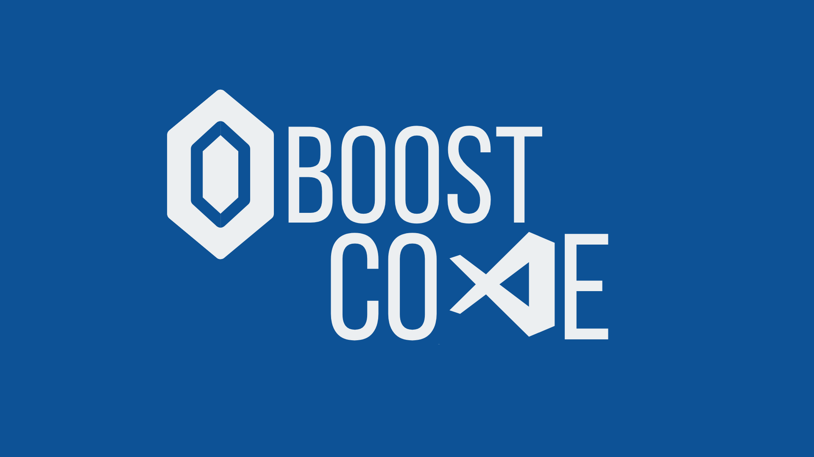

<h1 align="center">
  🔗Boost Code
</h1>

<div align="center">
  
  
  
  
  

  <a href="https://github.com/clasSeven7/boost-code/commits/master">
    
  </a>
  
  <a href="https://github.com/clasSeven7/boost-code/issues">
    
  </a>
</div>

<div align="center">
  
</div>

### 📖 Sobre

**Boost Code** é uma plataforma inovadora projetada para acelerar seu aprendizado em programação e desenvolvimento de software. Nosso objetivo é fornecer ferramentas e recursos que ajudem desenvolvedores a aprimorar suas habilidades rapidamente.

### Funcionalidades

- **Gerenciamento de Links:** Criação, atualização, exclusão e recuperação de links.
- **Autenticação de Usuário:** Sistema seguro utilizando a autenticação do Django.
- **API RESTful:** Oferece uma API para operações CRUD de gerenciamento de links.
- **Interface de Administração:** Controle usuários e links via Django Admin.

### Tecnologias Utilizadas

- **Django:** Framework web em Python que promove um desenvolvimento rápido e design limpo.
- **Django Rest Framework:** Conjunto de ferramentas para construir APIs web.
- **PostgreSQL:** Banco de dados relacional robusto com suporte a transações ACID.
- **Docker e Docker Compose:** Utilizados para configurar o ambiente de desenvolvimento.

### 🛠 Instalação com Docker

Para rodar o projeto localmente usando Docker e Docker Compose, siga os passos abaixo:

#### Pré-requisitos

- Docker
- Docker Compose

#### Passos para instalação

**1. Clone o repositório:**

```bash
  git clone https://github.com/clasSeven7/boost-code.git
  cd boost-code
```

**2. Construa e inicie os containers:**

```bash
  ./run_django.sh
```

Isso vai rodar um script que irá construir os containers e iniciar os serviços.

**Isso iniciará os serviços:**

- **web:** O servidor Django rodando na porta `8000`.
- **db:** O banco de dados PostgreSQL rodando na porta `5432`

**3. Acesse o projeto:**

Abra o navegador e vá para `http://localhost:8000` para acessar a aplicação.

### 🛠 Instalação Manual

Se preferir rodar o projeto sem Docker, siga os passos abaixo:

#### Pré-requisitos

- Python 3.x
- pip (instalador de pacotes Python)
- Virtualenv (opcional, mas recomendado)

#### Passos para instalação

**1. Clone o repositório:**

```bash
git clone https://github.com/clasSeven7/boost-code.git
cd boost-code
```

**2. Crie e ative um ambiente virtual (opcional, mas recomendado):**

```bash
python3 -m venv venv
source venv/bin/activate
```

**3. Instale as dependências:**

```bash
pip install -r requirements.txt
```

**4. Aplique as migrações:**

```bash
python3 manage.py migrate
```

**5. Crie um superusuário para acessar a interface de administração do Django:**

```bash
python3 manage.py createsuperuser
```

**6. Execute o servidor de desenvolvimento:**

```bash
python3 manage.py runserver
```

**7. Acesse a aplicação:**

- Acesse `http://127.0.0.1:8000/`.
- A interface de administração estará em `http://127.0.0.1:8000/admin/`.

### 🖥 Endpoints da API

A aplicação possui uma API RESTful para gerenciar links. Abaixo alguns dos endpoints:

- `GET /api/links/`: Recupera todos os links.
- `POST /api/links/`: Cria um novo link.
- `GET /api/links/{id}/`: Recupera um link específico.
- `PUT /api/links/{id}/`: Atualiza um link específico.
- `DELETE /api/links/{id}/`: Exclui um link específico.

#### Exemplos de Requisições

**Criar um Novo Link:**

```bash
curl -X POST http://127.0.0.1:8000/api/links/ -H "Content-Type: application/json" -d '{"url": "https://exemplo.com", "description": "Descrição do link"}'
```

**Recuperar Todos os Links:**

```bash
curl http://127.0.0.1:8000/api/links/
```

### 🔍 Testes

A aplicação inclui uma suíte de testes para verificar a integridade das funcionalidades.

**Dependências para Testes:**

- Django
- Django REST Framework
- Django REST Framework Simple JWT (para autenticação)

#### Descrição dos Testes

A classe `PostAPITestCase` realiza os seguintes testes:

- **Criação de Post:** Verifica se um post pode ser criado por um usuário autenticado.
- **Recuperação de Post:** Testa se um post existente pode ser recuperado.
- **Atualização de Post:** Valida se um post pode ser atualizado.
- **Exclusão de Post:** Confirma que um post pode ser excluído.
- **Criação de Post sem Autenticação:** Garante que a criação de um post é negada sem autenticação.

#### Exemplo de Testes

**Criação de Post:**

```python
def test_create_post(self):
  response = self.client.post('/api/post/', {'title': 'Novo Post', 'content': 'Conteúdo'}, HTTP_AUTHORIZATION=self.authorization_header)
  self.assertEqual(response.status_code, 201)
```

**Atualização de Post:**

```python
def test_update_post(self):
  post = Post.objects.create(title='Post', content='Conteúdo')
  response = self.client.patch(f'/api/post/{post.id}/', {'title': 'Post Atualizado'}, HTTP_AUTHORIZATION=self.authorization_header)
  self.assertEqual(response.status_code, 200)
```

#### Executando Testes

Execute os testes com o comando:

```bash
python3 manage.py test
```

### 🚀 Como Contribuir

Contribuições são bem-vindas! Para contribuir:

1. Faça um fork do repositório.
2. Crie um novo branch `(git checkout -b feature/NovaFuncionalidade)`.
3. Faça suas alterações.
4. Commit suas alterações `(git commit -m 'Adicionar nova funcionalidade')`.
5. Envie para o branch `(git push origin feature/NovaFuncionalidade)`.
6. Abra um pull request
